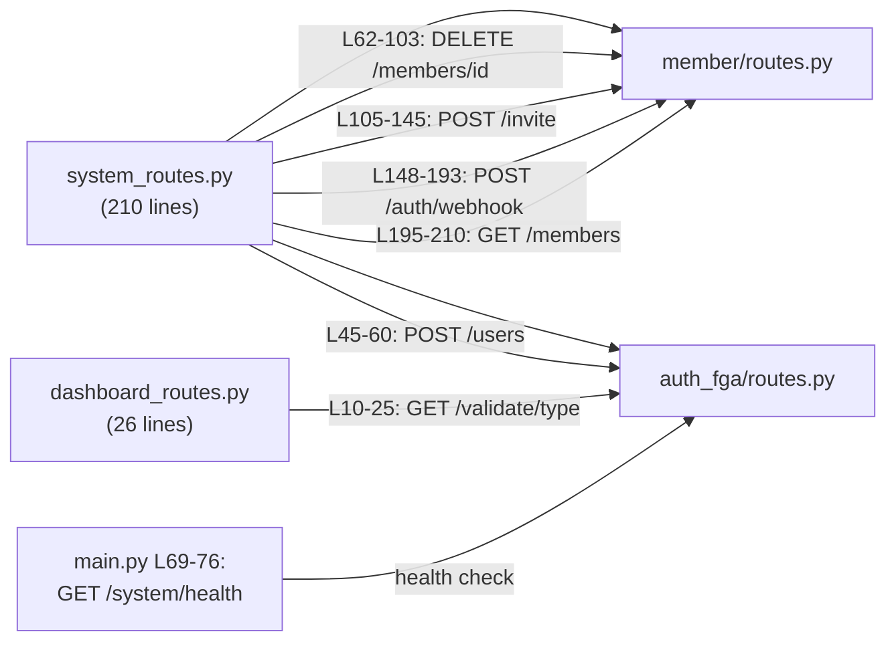

# Requirements: Modular Monolith Refactor

## 1. Goal

Refactor `backend/app` from a **layered architecture** (models/, routes/, services/, utils/) to a **modular monolith** organised by **business domain** under `app/modules/`.

---

## 2. Current Architecture (Before)

```
backend/app/
├── main.py
├── config.py
├── database.py
├── __init__.py
├── fga/
│   └── model.fga.yaml
├── models/
│   ├── resource.py
│   ├── member.py
│   └── invitation.py
├── routes/
│   ├── resource_routes.py
│   ├── system_routes.py
│   └── dashboard_routes.py
├── services/
│   └── authorization_service.py
└── utils/
    ├── auth0_fga_client.py
    └── security.py
```

> [!NOTE]
> **What's wrong with the current structure?**
> The current layout groups files by **technical layer** (models, routes, services). This works for small apps, but as complexity grows, a single route file like `system_routes.py` ends up owning logic for members, invitations, webhooks, and role assignment — all unrelated concerns packed together. The modular approach groups files by **what they do in the business**, not what technical role they play.

---

## 3. Target Architecture (After)

```
backend/app/
├── main.py                         # App factory & lifespan
├── __init__.py
├── core/                           # Shared infrastructure
│   ├── __init__.py
│   ├── config.py                   # ← from app/config.py
│   ├── database.py                 # ← from app/database.py (Base, engine, session ONLY)
│   └── security.py                 # ← from app/utils/security.py (JWT + HMAC, cross-cutting)
│
└── modules/
    ├── __init__.py
    │
    ├── resource/                   # Resource domain
    │   ├── __init__.py
    │   ├── model.py                # ← SQLAlchemy: ResourceDB
    │   ├── schema.py               # ← Pydantic: Resource schemas
    │   └── routes.py               # ← from app/routes/resource_routes.py
    │
    ├── member/                     # Member + Invite domain
    │   ├── __init__.py
    │   ├── model.py                # ← SQLAlchemy: MemberDB, InvitationDB
    │   ├── schema.py               # ← Pydantic: Member, Invitation, Auth0RegistrationPayLoad
    │   └── routes.py               # ← member/invite routes extracted from system_routes.py (includes webhook)
    │
    └── auth_fga/                   # FGA authorization domain
        ├── __init__.py
        ├── client.py               # ← from app/utils/auth0_fga_client.py (renamed)
        ├── service.py              # ← from app/services/authorization_service.py (renamed)
        ├── routes.py               # ← role assignment, dashboard validation, health check
        └── model.fga.yaml          # ← from app/fga/model.fga.yaml
```

---

## 4. Module Specifications

### 4.1 `app/core/` — Shared Infrastructure

| File | Source | Contents |
|------|--------|----------|
| `config.py` | `app/config.py` | `Settings` class, `settings` singleton |
| `database.py` | `app/database.py` | Engine, session factory, `Base`, `get_db`, `init_db`. **(SQLAlchemy models move out)** |
| `security.py` | `app/utils/security.py` | `verify_signature`, `verify_auth0_token`, `jwks_client`, plus `get_current_user` dependency |

> [!TIP]
> **Design tip — The dependency direction test.**
> Ask yourself: *"If I deleted the `auth_fga` module entirely, would this code still make sense?"* JWT verification and HMAC signatures are general security primitives — they'd exist even without FGA. That confirms they're infrastructure, not domain logic. `core/` is correct.

---

### 4.2 `app/modules/resource/` — Resource Domain

| File | Source | Responsibility |
|------|--------|----------------|
| `model.py` | Extracted from `database.py` | SQLAlchemy: `ResourceDB` |
| `schema.py` | `app/models/resource.py` | Pydantic: `ResourceBase`, `ResourceCreate`, `ResourceUpdate`, `Resource` |
| `routes.py` | `app/routes/resource_routes.py` | CRUD endpoints: `GET /`, `GET /{id}`, `POST /`, `DELETE /{id}` |

---

### 4.3 `app/modules/member/` — Member & Invitation Domain

| File | Source | Responsibility |
|------|--------|----------------|
| `model.py` | Extracted from `database.py` | SQLAlchemy: `MemberDB`, `InvitationDB` |
| `schema.py` | `app/models/member.py` + `app/models/invitation.py` | Pydantic schemas for Member and Invitation. Includes `MemberStatus`, `Role`, `Auth0RegistrationPayLoad` |
| `routes.py` | Extracted from `app/routes/system_routes.py` | Routes that manage member lifecycle + invitation flow |

**Routes to extract into `member/routes.py`:**

| Route | Current location | Why it belongs here |
|-------|-----------------|---------------------|
| `DELETE /members/{member_id}` | `system_routes.py` L62–103 | Directly manages member status transitions |
| `POST /invite` | `system_routes.py` L105–145 | Creates an invitation and a pending member |
| `POST /auth/webhook/post-registration` | `system_routes.py` L148–193 | Activates a member after registration (consumes invitation) |
| `GET /members` | `system_routes.py` L195–210 | Lists members |

> [!IMPORTANT]
> **Design tip — The webhook route is the hardest call.**
> `POST /auth/webhook/post-registration` touches both member activation **and** FGA role assignment. It lives at the seam between the `member` and `auth_fga` domains. We put it in `member/` — that's defensible because the **primary entity being mutated** is the member record. The FGA call is a side-effect. A good rule of thumb: *"The module that owns the data being written owns the route."*

---

### 4.4 `app/modules/auth_fga/` — FGA Authorization Domain

| File | Source | Responsibility |
|------|--------|----------------|
| `client.py` | `app/utils/auth0_fga_client.py` | `Auth0FGAClient` class, `fga_client` singleton |
| `service.py` | `app/services/authorization_service.py` | `AuthorizationService` class, `authz_service` singleton |
| `routes.py` | Extracted from `system_routes.py` + all of `dashboard_routes.py` | Routes focused on authorization checks and role management |
| `model.fga.yaml` | `app/fga/model.fga.yaml` | OpenFGA authorization model definition |

**Routes to extract into `auth_fga/routes.py`:**

| Route | Current location | Why it belongs here |
|-------|-----------------|---------------------|
| `POST /users` (assign role) | `system_routes.py` L45–60 | Pure FGA role assignment, no member/invite data |
| `GET /validate/{dashboard_type}` | `dashboard_routes.py` L10–25 | Pure FGA permission check |
| `GET /health` | `main.py` L69–76 | FGA health check — move out of `main.py` |

---

## 5. Decomposition of `system_routes.py`

This is the most complex file to break apart. Here's the full mapping:



---

## 6. Import Path Changes

All internal imports must be updated. Key changes:

| Old Import | New Import |
|------------|------------|
| `from app.config import settings` | `from app.core.config import settings` |
| `from app.database import get_db, ResourceDB, ...` | `from app.core.database import get_db` and `from app.modules.resource.model import ResourceDB` |
| `from app.utils.security import ...` | `from app.core.security import ...` |
| `from app.utils.auth0_fga_client import fga_client` | `from app.modules.auth_fga.client import fga_client` |
| `from app.services.authorization_service import ...` | `from app.modules.auth_fga.service import ...` |
| `from app.models.resource import ...` | `from app.modules.resource.schema import ...` |
| `from app.models.member import ...` | `from app.modules.member.schema import ...` |
| `from app.models.invitation import ...` | `from app.modules.member.schema import ...` |

---

## 7. `main.py` Updates

After the refactor, `main.py` should:

1. Import routers from modules:
   ```python
   from app.modules.resource.routes import router as resource_router
   from app.modules.member.routes import router as member_router
   from app.modules.auth_fga.routes import router as auth_fga_router
   ```

2. Register routers with appropriate prefixes:
   ```python
   app.include_router(resource_router, prefix="/resources", tags=["resources"])
   app.include_router(member_router, prefix="/members", tags=["members"])
   app.include_router(auth_fga_router, prefix="/auth", tags=["authorization"])
   ```

3. Remove the inline `GET /system/health` and `GET /items` endpoints.

4. Update lifespan imports to use `app.core.*` and `app.modules.auth_fga.*`.

> [!TIP]
> **Design tip — Prefix strategy.**
> Your current prefixes (`/system`, `/dashboard`) are implementation-oriented. With modules, you have a chance to make them API-consumer-oriented: `/members`, `/resources`, `/auth`. Think about what makes sense from the perspective of someone reading your OpenAPI docs. The URL should tell you *what you're acting on*, not *which internal system handles it*.

---

## 8. Migration Order

Execute the refactor in this order to keep the app working at every step:

| Step | Action | Risk |
|------|--------|------|
| 1 | Create `app/core/` — move `config.py`, `database.py` (engine only), `security.py`. Update imports. | Low |
| 2 | Create `app/modules/resource/` — create `model.py` and `schema.py`, move `routes.py`. Update imports. | Low |
| 3 | Create `app/modules/auth_fga/` — move `client.py`, `service.py`, `model.fga.yaml`. Update imports. | Medium |
| 4 | Create `app/modules/member/` — extract routes from `system_routes.py`, split models and schemas. | High |
| 5 | Create `app/modules/auth_fga/routes.py` — extract remaining routes from `system_routes.py` + `dashboard_routes.py`. | High |
| 6 | Update `main.py` — new router imports, clean prefixes, remove inline endpoints. | Medium |
| 7 | Update all test files — fix imports, optionally restructure test directories. | Low |
| 8 | Delete old empty directories (`app/models/`, `app/routes/`, `app/services/`, `app/utils/`, `app/fga/`). | Low |

---

## 9. Files to Delete After Migration

Once all code is moved and tests pass:

- `app/config.py`
- `app/database.py`
- `app/models/` (entire directory)
- `app/routes/` (entire directory)
- `app/services/` (entire directory)
- `app/utils/` (entire directory)
- `app/fga/` (entire directory)
